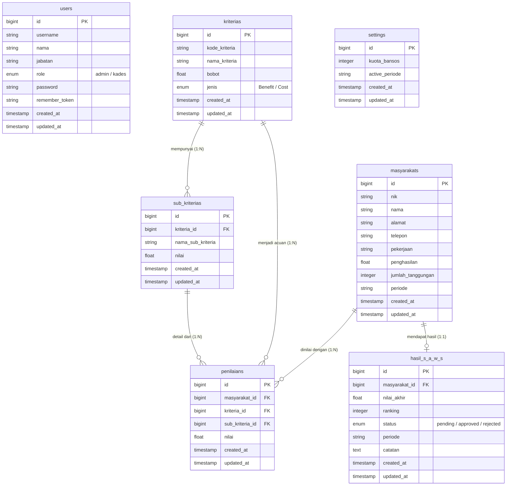

# Logical Record Structure (LRS) - SPK Bansos

Berikut adalah representasi LRS (Struktur Tabel Rekaman Logis) dari basis data aplikasi Sistem Pendukung Keputusan (SPK) Bantuan Sosial menggunakan metode SAW. 

Setiap kotak merepresentasikan tabel (Entitas) berserta tipe data dan kolom-kolomnya. Garis penghubung menunjukkan relasi antara tabel utama (Primary Key) dengan tabel terkait (Foreign Key).

### Penjelasan Relasi Tabel:
1. **`kriterias` ke `sub_kriterias` (One-to-Many):** Setiap Kriteria (contoh: Penghasilan) bisa memiliki banyak rentang Sub-Kriteria (contoh: < 1 Juta, 1-2 Juta).
2. **`masyarakats` ke `penilaians` (One-to-Many):** Satu warga (Masyarakat) akan memiliki banyak penilaian, masing-masing untuk setiap Kriteria yang ada.
3. **`kriterias` & `sub_kriterias` ke `penilaians` (One-to-Many):** Tabel Penilaian bertindak sebagai *Pivot/Junction Table* yang mencatat nilai spesifik warga berdasarkan parameter Sub-Kriteria dari sebuah Kriteria tertentu.
4. **`masyarakats` ke `hasil_s_a_w_s` (One-to-One):** Setiap warga yang divalidasi akan memiliki satu hasil perhitungan akhir SAW (beserta *ranking* dan status validasinya) per periode.
5. Tabel **`users`** dan **`settings`** saat ini berdiri mandiri (*independent*) digunakan untuk autentikasi sistem dan konfigurasi global.
